# 🎮 GitHub Contribution Pac-Man

> **Pac-Man eating your GitHub contributions!**  
> Apna GitHub profile zyada fun banana — bilkul us image ki tarah!

<!-- After running the workflow, replace YOUR_USERNAME with your GitHub username -->


---

## 🚀 Setup — Apne GitHub Profile Mein Kaise Add Karein

### Step 1 — Repository Create Karein

Apne GitHub username ke naam ki ek **special repository** banao.  
Example: agar username `arpit123` hai toh repo ka naam bhi `arpit123` hona chahiye.

```
github.com/arpit123/arpit123   ← yeh aapka profile repo hai
```

### Step 2 — Files Upload Karein

Is project ki saari files us repo mein copy karo:
```
arpit123/
├── .github/
│   └── workflows/
│       └── pacman.yml   ← Auto-generates SVG daily
├── generate_svg.py      ← SVG generator script
├── README.md            ← Aapka profile README
└── pacman.svg           ← Auto-generated (pehle baar manually run karo)
```

### Step 3 — SVG Pehli Baar Generate Karein

```bash
# Local machine par:
python generate_svg.py --username YOUR_GITHUB_USERNAME

# Ya sirf demo data se test karo:
python generate_svg.py --demo
```

### Step 4 — README mein Add Karein

Apne `README.md` mein yeh line add karo:

```markdown

```

### Step 5 — GitHub Pages pe Playable Game

Agar pura khelne wala game bhi chahiye:

1. GitHub repo settings → **Pages** → Source: `main` branch, root `/`
2. Game live ho jayega: `https://YOUR_USERNAME.github.io/YOUR_REPO_NAME/`

---

## 🎮 Controls

| Key | Action |
|-----|--------|
| ⬆⬇⬅➡ Arrow Keys | Move Pac-Man |
| `W A S D` | Move Pac-Man |
| `P` | Pause / Resume |
| `R` | Restart |
| 📱 Swipe | Mobile support |

---

## 🧩 Game Features

- **52 × 7 grid** — exactly like GitHub's contribution graph
- **4 Ghosts** with different AI personalities:
  - 👻 **Blinky** (Red) — direct chase
  - 👻 **Pinky** (Pink) — intercepts ahead of you
  - 👻 **Inky** (Blue) — ambush strategy
  - 👻 **Clyde** (Orange) — scatters when close
- **Power Pellets** in corners — eat ghosts for 200 pts bonus!
- **High Score** saved in browser
- **Mobile friendly** (touch swipe support)
- **GitHub Dark Mode** colour palette 🖤

---

## 📊 Scoring

| Action | Points |
|--------|--------|
| Eat a contribution cell | +10 |
| Eat a power pellet | +50 |
| Eat a frightened ghost | +200 |

---

## 🛠️ Local Development

```bash
# Clone and open directly in browser
git clone https://github.com/YOUR_USERNAME/YOUR_REPO_NAME
cd YOUR_REPO_NAME

# Open the game
start index.html    # Windows
open index.html     # Mac
xdg-open index.html # Linux

# Generate/update SVG
python generate_svg.py --username YOUR_USERNAME
```

---

## 📁 File Structure

```
game tab/
├── index.html          ← Game HTML (open this to play!)
├── style.css           ← GitHub dark theme styling
├── game.js             ← Complete Pac-Man engine
├── generate_svg.py     ← Animated SVG generator for README
├── pacman.svg          ← Auto-generated animated SVG
├── .github/
│   └── workflows/
│       └── pacman.yml  ← Daily auto-update workflow
└── README.md           ← This file
```

---

## 💡 Inspired By

The popular GitHub Pac-Man contribution graph trend — showing how your
coding activity looks like a Pac-Man level!

---

*Made with 💚 and JavaScript*
